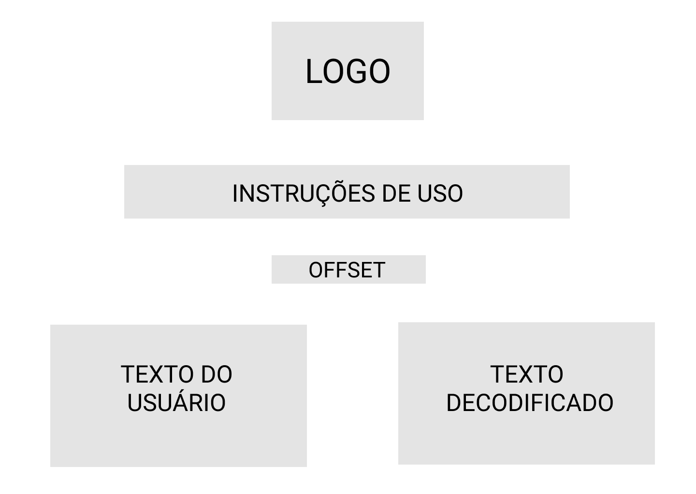
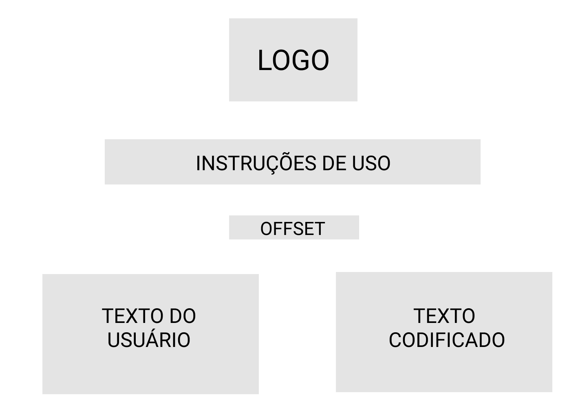

# KUDOS TO YOU!

Você já ouviu falar em **Kudos**? Kudos, em inglês, significa "congratulação", "reconhecimento", "enaltecimento". Por isso, a **Kudos To You** foi idealizada como uma forma de aproximar pessoas através de elogios. Aqui, você poderá codificar uma mensagem de parabenização para entregá-la a alguém, bem como decodificar uma mensagem recebida.

## Definição do Produto

A **Kudos To You** cifra e decifra mensagens de parabenização voltadas para o meio corporativo. Assim, colegas de trabalho podem trocar elogios mesmo com aqueles que não tenham muito contato. Basta preencher o campo de " número de codificação" para que a mensagem seja codificada ou decodificada corretamente.

## Objetivos do Produto

Tendo em vista o meio corporativo e as formalidades envolvidas nele, enviar e receber Kudos é uma forma de se aproximar das pessoas e ainda incentiva-las ou parabenizá-las por seu trabalho. É importante ressaltar que a **Kudos To You** foi idealizada apenas para codificar e decodificar mensagens positivas e de congratulações. Não toleramos Kudos que tenham conteúdo ofensivo ou prejudique alguém de alguma forma. 

# Desenvolvimento do produto

Primeiramente, foi desenvolvido o wireframe do projeto. Como demonstrado abaixo, foi desenhado apenas o "esqueleto" das páginas. As cores, imagens e demais detalhes do projeto foram sendo decididos durante o desenvolvimento das páginas.

|  |
|:--:|
| *HOME PAGE* |

|  |
|:--:|
| *DECODE PAGE* |

|  |
|:--:|
| *ENCODE PAGE* |

Após, foi realizado um fluxograma para determinar cada ação do usuário e quais eram suas necessidades principais, como o campo de preenchimento do "número de codificação" *(offset)* e a *textarea* onde a mensagem seria inserida.
Inclusive, é válido ressaltar que foi adicionado um botão de voltar tanto na página de Encode como na página de Decode que não estava previsto no projeto inicial. Porém, no decorrer do desenvolvimento, verificou-se a necessidade do referido botão para melhorar a experiência do usuário. 

|  |
|:--:|
| *FLUXOGRAMA* |

Tendo a estrutura do HTML e do CSS prontas, foi separado um tempo para estudos para que a lógica do projeto pudesse ser desenvolvida. 
